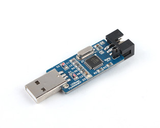

# A few initial notes: {#a-few-initial-notes}

Ok now that you are armed with a fair amount of knowledge on Arduino and its working, let’s get to the part where you make your own.

Use the schematic given above as a reference.

The essential components for the Arduino are power supply block, power supply connection to micro controller, crystal oscillator circuit and reset pull up. Do not change without proper study.

With the rest, feel free to tweak it as per your application. This will give you a greater control over the PCB, and also make the whole thing smaller.

If you are using a new IC brought directly from the market, first burn the bootloader using a programmer like the USBasp. A port for the USBasp has been provided on the ArduDIY board. You can use this to burn the bootloader and then use the IC elsewhere.

27990(1)For programming, you can use the programmer or any USB to Serial Converter like the one provided in this kit. Just make sure the connections are correct.

USBasp Programmer