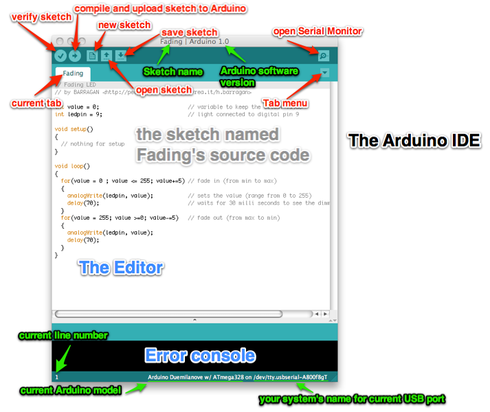

# ArduDIY {#ardudiy}
---

 

So now that we have gotten ourselves acquainted with microcontrollers and Arduino lets start on our current project the ArduDIY. ArduDIY stands for Arduino Do-It-Yourself (yeah I know you may have guessed it already). The only premade thing provided to you is the PCB (Printed Circuit Board) everything else shall be done by you. Also towards the end of this you shall be able to make an Arduino Board Completely from scratch. This shall be beneficial when you have to make projects where specialised board designs are required, or in some cases where prefabricated PCBs are not allowed.

This board is not pin compatible with the Arduino Boards. Due to this you will not be able to use Arduino shields but I urge you to try developing your very own. The pins of this board are breadboard and 0 pcb compatible so go ahead make what you want!

The reason this board was not made pin compatible with the Arduino is so that users could develop a better understanding of how the board actually works and is routed. This will help when you make your own Arduino board.

Let’s look at our system block by block.

This is a very top level diagram of our system. We have our computer, the converter, our Arduino Board and a power supply.

## PC

This will run the Arduino IDE (Integrated Development Environment) it looks like this:

  
  Image Credits: <a href="http://www.hacdc.org">http://www.hacdc.org</a>

We write our code here and use this to compile and upload the code. We can also communicate with the Arduino Board using the serial monitor of the IDE. It uses the USB port of the computer. The console displays status messages and also warnings and errors.

We write the code in the text editor part of this program. In Arduino our code file is called a sketch and saved with the extension “.ino”
