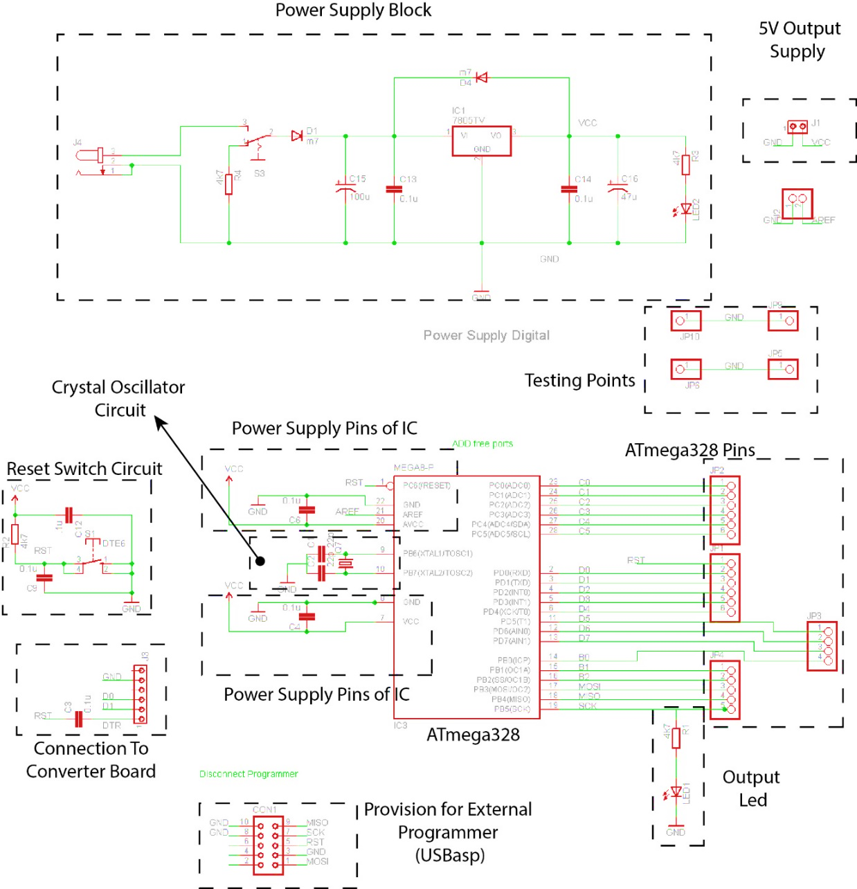

## ArduDIY Board {#ardudiy-board}

Now let’s look at our Arduino board. On a layout level it can be split into the following parts. We look at it this way as it makes understanding it easier.

Now every board has a corresponding schematic. Whenever we make a printed circuit board usually we have to create two files. The schematic \(.sch\) and the board \(.brd\) file. The schematic file must be created first.

The schematic file defines all the components that shall be used and the connection between all the pins of the components. Take for example we want to make a board with an AND gate. Before starting, the first thing to do is look at the datasheet of the IC 7408. This is a quad two input AND gate, that means there are four two input AND gates in this package. It may look huge and scary at first but believe me, as you read more and more datasheets it will get easier you will realize exactly which parameters to search in a datasheet and soon you will be able to understand a whole datasheet in just minutes.

| Logic Diagram | To understand what type the gate is. |
| --- | --- |
| Pin Layout | This is important for routing. |
| Power Supply | Power supply must always be within permissible limits. |
| Logic Voltage | This is the input/output voltage the pins support. |
|  |  |

So the parameters we shall look at now in the datasheet are:

So now that we have studied the electrical characteristics of the IC we are using, let’s start with the schematic. Let’s look at what all we will be needing on the board we make.

  

Now let’s put this in schematic format \(a little prior working knowledge of eagle is needed. I shall soon be making a tutorial on eagle basics.\)

You can see the lines represent just connections and not the actual physical layout. So here we have just defined all the components needed along with the connections for a simple AND gate board. This was just to get you accustomed to the design process.

Now that were familiar let’s look at the schematic of our ArduDIY Board:

Have a look at this and try to understand whatever you can. Every component is named. Look at where it is connected and see if you can understand why it is connected there. Labels are used to make the wiring in this schematic easier. Labelling means that in the schematic all same named wires \(or nets\) are connected. So all labels saying “VCC” are actually connected. When designing you can use the show command of eagle to observe the complete connection. At the centre is our microcontroller \(Atmega328\) and there are 28 pins coming out of this package and every pin has a specific purpose. If we want the controller to work as it should every pin must be properly connected as per instructions given in the datasheet. Also take the PCB in your hand and see where each component in the schematic is placed. Try to locate all components. \(This is important in order to understand routing of the board\)

Ok so once you have had a good and through look at the above circuit you can go ahead.

Here is the same schematic with blocks based on function. Check how G:\data1\ArduDIY\Images\Scematic Explanation.jpgmany of them you guessed correctly.

This is the bare minimum of what all is required for the microcontroller to run. Capacitors are used for decoupling \(to remove noise or varying elements\). Resistors are used to pull-up and for current limiting.

Now that we have seen the schematic let’s look at the board file. The board file has an extension .brd and it defines the actual physical layout.

As you can see it is harder to realise the connections between components in the physical layout. That is the reason we need to first define the components and their connection in the schematic file and then proceed to layout.
