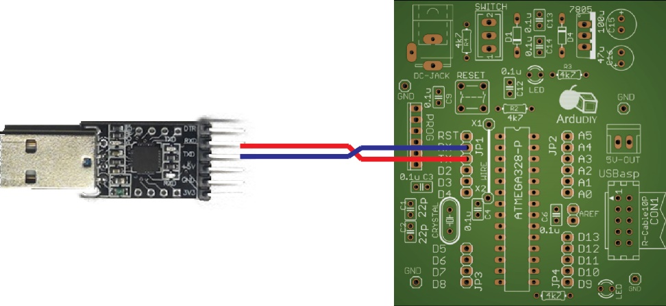

## Converter: {#converter}

Our board and the Arduino IDE running on the computer need to communicate. Now in hardware communication is done with the help of protocols. Think of protocols as languages of hardware communication. Protocols define the way communication should take place and also the data that can be sent and received (Similar to grammar and words in a language). Some commonly used protocols are RS-232, USB, UART, USART, and SPI. When two people are talking if one speaks English and the other speaks French the conversation will be pointless, similarly for two boards to communicate they must support the same protocol. The USB protocol is somewhat of a high level protocol, the IC we are using (Atmega328) does not support it so we need device to act as a translator in between our computer and our board. This is the purpose of our converter board. The board communicates with our computer using USB protocol and with our controller using UART (universal asynchronous receiver/transmitter) protocol. It is powered using the 5V supply on our Computer but we shall not be using the same supply to power our ArduDIY board. The reason for this is that if something goes wrong in our circuit it can damage the Serial Port on the computer.

Now this converter board is universal. You can use it with any other board and any other microcontroller as well. It is a serial to USB converter. The signal voltage of this board is 3.3V, it is compatible with all ATmega microcontrollers.

It’s most important use is that we shall be using it as a programmer to upload our program to the Arduino. You plug it into your computer/laptop directly and from the pins that come out the ones we need are:

| DTR | Data Terminal Ready | It is a handshake signal which initialises communication. |
| --- | --- | --- |
| RXD | Receive | Serial Data receive pin. |
| TXD | Transmit | Serial Data transmit pin. |
| GND | Ground | Signals are defined with respect to GROUND. Hence for two ICs to communicate they must understand each other’s signals and thus their grounds must be common. |

And important thing to note is that the RX of out converter is the TX of our Arduino (Atmega328) and the TX of our converter is the RX of the Atmega328\. UART is a serial protocol so the data transmitted by one chip is received by the other on the same line. Hence this configuration.

G:\data1\ArduDIY\Images\UART_Connection.jpg
