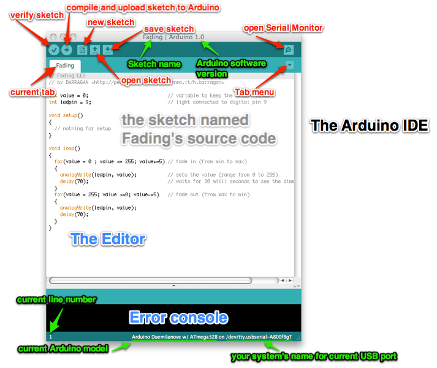

## PC {#pc}

This will run the Arduino IDE (Integrated Development Environment) it looks like this:

  
   
  Image Credits: <a href="http://www.hacdc.org">http://www.hacdc.org</a>

We write our code here and use this to compile and upload the code. We can also communicate with the Arduino Board using the serial monitor of the IDE. It uses the USB port of the computer. The console displays status messages and also warnings and errors.

We write the code in the text editor part of this program. In Arduino our code file is called a sketch and saved with the extension “.ino”
