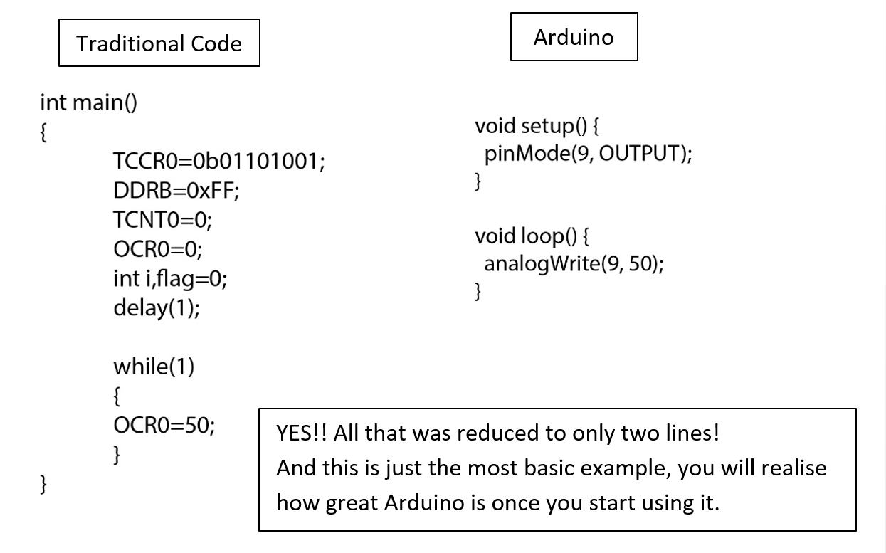

# Arduino {#arduino}

---

 

Arduino is an open source prototyping platform. It consists of both hardware as well as software. This means that Arduino has defined the hardware (microcontrollers) which can be used and also provides us with the Arduino IDE where we write the code. Now this is a huge advantage as the whole system comes under one roof. Earlier we had to use one brand of microcontrollers, a second software to write the code, a separate compiler and a fourth software to upload the code. Arduino does all these things for us. That is one of the reasons it is so popular. The Arduino hardware and software was designed for artists, designers, hobbyists, hackers, newbies, and anyone interested in creating interactive objects or environments. Arduino can interact with buttons, LEDs, motors, speakers, GPS units, cameras, the internet, and even your smart-phone or your TV!

Now open source means that the code developed is free for everyone to view and edit. The outcome of this is that thousands of talented coders are working on Arduino as we speak. The whole system is constantly developing and everyone gets the benefits. The whole community is friendly and all question are answered on the forums. Now as this is open source a lot of libraries are readily available. A library is a set of codes specific to some application. Suppose you want to run a servo motor, to write the actual code can be quite cumbersome so we use a library developed for servo motors. This library contains all functions required in one package.

Arduino programming is done in a simplified version of C++, one just needs to know the basics and then can start programming right away.

What Arduino does is it greatly simplifies the whole code writing process. This is especially useful for people like us, who are more interested in implementing things rather than dealing with the whole computer part of it. How does it simplify the code? Let me give you an example.Suppose we want to run a motor with variable rpm. For this we need the PWM signal from the microcontroller. Now in traditional approach the code would be:

Now you must be thinking “How is this possible!? Is it really this easy?” Well yes. It is so because hundreds of people have already put in effort. It’s not like the code required has magically shrunk. There is a code behind what we write and that is huge. See what the people at Arduino did is that they created standard libraries and functions for everyone to use. So the extra lines you see in the first code are actually there but they are being used by us through the functions defined by the creators of Arduino.

Just to give you a Perspective, this is the Arduino Header
If you want to actually read it, just open “arduino.h” located in the program files.

