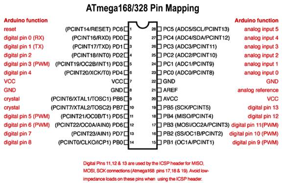

# Arduino Basics {#arduino-basics}

Arduino has been designed such that it is very easy to learn for new users. Before starting just brush up on the basics of C/C++. This is essential to understand the Arduino code.

The main important concepts you must cover are: syntax, data types, functions (in detail), condition statements (if-else, while, do while etc.), structures, classes (for advanced users and library manipulation). Most of the Arduino code is created using structures and classes. Hence we need proper knowledge of these and also how to access them (for example the dot operator used to access functions of objects of a particular class).Once you know C/C++ you will understand part of the code immediately when you read it. A big help is that Arduino functions are very well named. Just take care which letters are capital and which small. Let us look at the code you just ran.

This part defines the code example. And gives a brief explanation.

/*

Blink

Turns on an LED on for one second, then off for one second, repeatedly.

Most Arduinos have an on-board LED you can control. On the Uno and

Leonardo, it is attached to digital pin 13\. If you&#039;re unsure what

pin the on-board LED is connected to on your Arduino model, check

the documentation at http://www.arduino.cc

Before we use any pin, we must first define how we are using it. Here we define a digital pin as OUTOUT

This example code is in the public domain.

modified 8 May 2014

by Scott Fitzgerald

*/

// the setup function runs once when you press reset or power the board

void setup() {

Once we define the pin we can use it.

// initialize digital pin 13 as an output.

pinMode(13, OUTPUT);

}

// the loop function runs over and over again forever

void loop() {

digitalWrite(13, HIGH); // turn the LED on (HIGH is the voltage level)

delay(1000); // wait for a second

digitalWrite(13, LOW); // turn the LED off by making the voltage LOW

delay(1000); // wait for a second

}

When you read this example code you will see how well it is commented. Arduino code examples are the best way to learn Arduino.

One approach to follow while learning Arduino is, first decide what you want to do (this depends what you was running using the Arduino) then search for code example available. The examples folder in Arduino itself contains a lot of code samples. Understand these code examples and then write your own code. DO NOT copy paste. Understand and write it yourself.

The coding convention followed by Arduino is a bit different. It is used throughout Arduino and if you are going to publish your code online it is recommended that you stick to the Arduino convention of writing. The most important thing in Arduino is **PINS ARE NOT ACCESSED BY THE ACTUAL PIN NUMBER OF THE MICROCONTROLLER.** Those who are familiar with embedded coding will remember that we always used to access registers (PORT, Data Direction) using the actual pin numbers.Instead the Arduino developers have come up with its own pin mapping and naming configuration. This widely divides the pins as Digital and Analog. Now we don’t have to use registers at all, Arduino takes care of this for us. Digital pins are those which can input and output digital values. Along with this they also have pin specific functions. PWM pins are a part of digital pins. Please note that while using PWM, you will have to use only those pins which are capable of producing a PWM output. The analog pins are those which have ADC (Analog to Digital Converter Capabilities). A thing to note here is that all Analog pins can be used as digital pins but digital pins cannot be used as analog pins.

Another thing you will notice when you start reading Arduino code is the efficient use of macros and identifiers. So suppose you are using a red coloured hitswitch in your project, now this hitswitch is connected on pin 7 on the Arduino. So when we write the code whenever we want to access anything related to this hitswitch we use it like digitalRead(7);or pinMode(7);Obviously we will use these functions multiple times at different places in our code. Later we want to use pin number 7 as a Led indicator. Now what? We will have to sit and change every instance of 7 to something else. That is a pain. So what we do in in the beginning define the pin number eg;int red_hitswitch = 7;Now wherever we want to access this pin we just replace it with red_hitswitch.digitalRead(red_hitswitch);or pinMode(red_hitswitch);This makes reading and writing the code easier and now even if we want to change the pin assignment in the future we just chance the definition and nothing else.

G:\data1\ArduDIY\Images\arduinoUnoPinMap.jpgThis is the pin mapping Arduino uses:

Let’s go over the basics of what you will require to get started. Now for a microcontroller as we saw earlier, ever pin has multiple functions. Some of the important ones are Digital Pin (Input or Output), Analog to Digital Conversion, PWM. Arduino has specific functions defined for all of these. Let’s look at them.

pinMode (Pin_Number, INPUT/OUTPUT) – This defines the pin as either an input or output. This has to be done prior to using that pin.

digitalWrite(Pin_Number, HIGH/LOW) – This is the function to write a digital value to a pin. Digital value means that the voltage seen on the pins can only be high (5V) or low (0V).

digitalRead(Pin_Number) – Through this function we can read a voltage level on the given pin. As this is digital the value can be only HIGH (5V) or LOW (0V). This function returns the value which is read hence it must be assigned to a variable.e.g.; buttonState = digitalRead(buttonPin);

analogWrite(Pin_Number, PWM_Value) – The analog write function lets us output PWM on a particular pin. Please note that only pins with PWM capabilities can be used. On the Ardunio UNO (and our board) these are **(3, 5, 6, 9, 10, 11).**

analogRead(Pin_Number) – This is the function to read the analog value present on the ADC pins of the microcontroller. This function returns an integer value hence it must be assigned to a variable.It only works with the ADC pins i.e. (A0-A5).e.g.; sensorValue = analogRead(sensorPin);

These are just the very basics. Everything about using Arduino is available on the net. Let google be your teacher. If you have any doubts or queries, just google it.