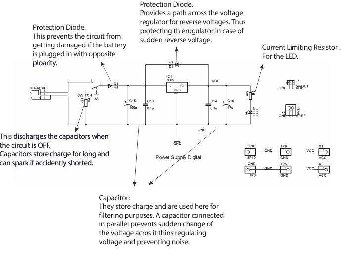
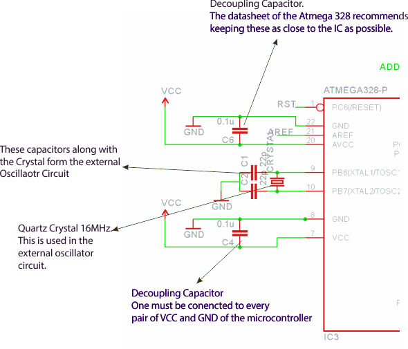
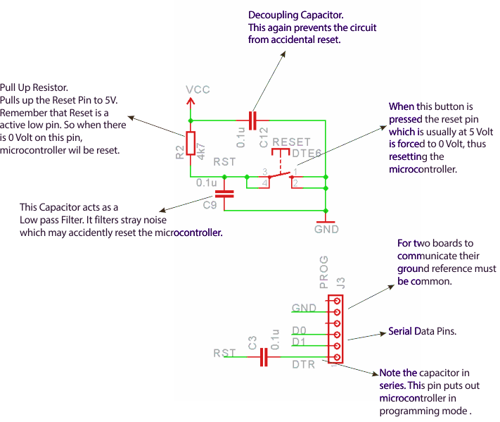
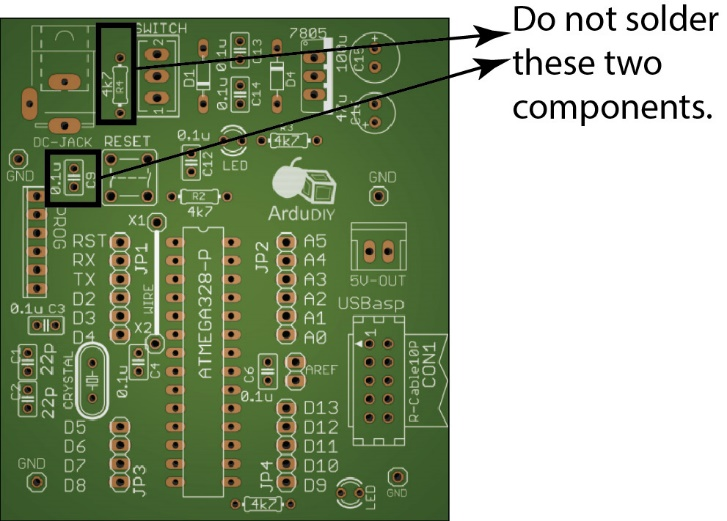

# Circuit Working {#circuit-working}
---

Now that we know what component is what, let’s look at the circuit a little more in detail and understand its working.

This is the Power Supply Block. Its main function is to generate 5V regulated voltage to run our microcontroller and other peripherals.

This block contains the power supply pins and the oscillator circuit of our microcontroller. These are the most important pins required for out microcontroller to work.

This is the reset and programming connection circuit diagram.

**Kindly Note**

**DO NOT SOLDER CAPACITOR C9 and RESISTOR R4.**

****It has been added to prevent stray noise from resetting the controller in noisy environments. But if this capacitor is added the board cannot be programmed using the converter board.If you need this capacitor (due to problems of noise) you will need to program this board using the external programmer.
The resistor provides a continuous load to the power supply. But if this is used with a 9V battery it will drain fast.****

