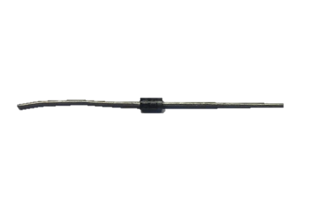
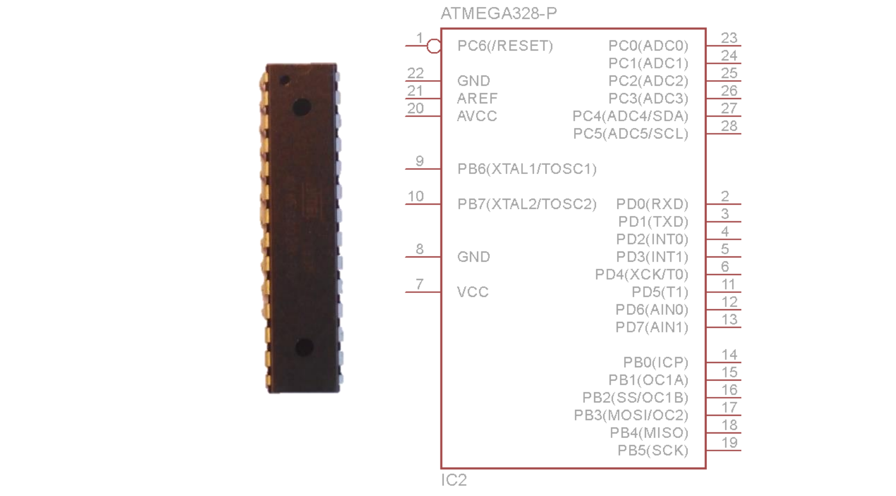
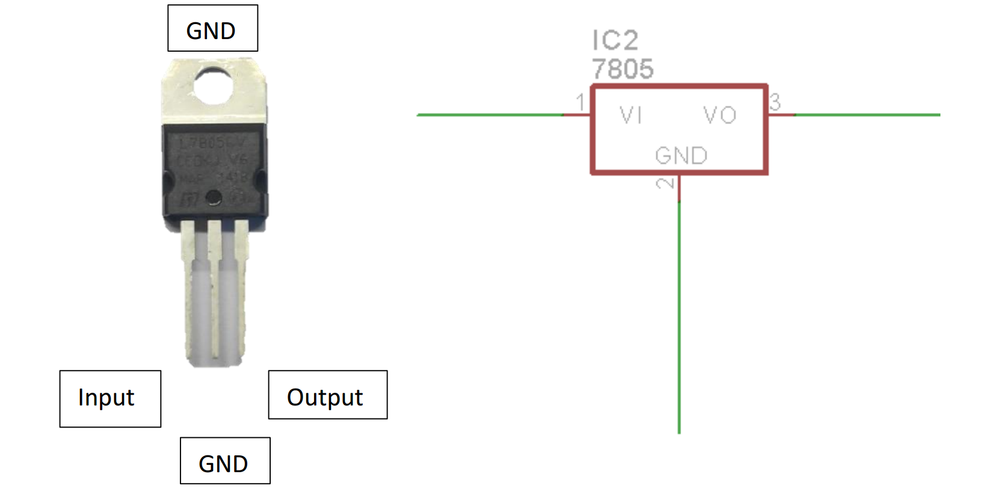
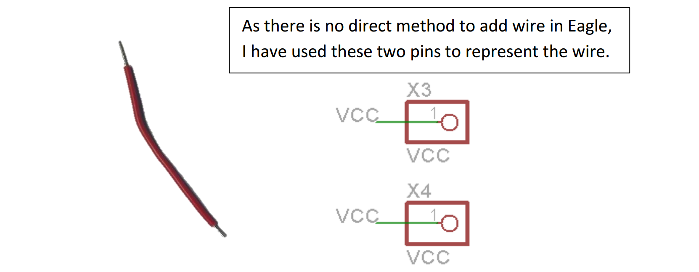

# Components {#components}
---

 

Let’s have a look at all the components present in here so that it shall be easier to solder the board.

**Resistor:-** 4k7 or 4700Ohms.

22pF

G:\data1\ArduDIY\Images\splabcomponents\IMG_20151212_204123.jpg

Long Legs

Small head

22AEC

**Ceramic Capacitor:-**Ok we have ceramic capacitors of two different values. Please take care that you identify both correctly as it is very important during soldering. A mix up here can be very hard to debug later.

104

G:\data1\ArduDIY\Images\splabcomponents\IMG_20151212_204213.jpg

Large head

Short Legs

0.1uF

G:\data1\ArduDIY\Images\splabcomponents\IMG_20151212_204142.jpg

**Electrolytic Capacitor:-**

Here again we have two different values. But these are easier to spot as the values are written on the capacitor itself. Along with capacitance value these capacitors also vary based on voltage value. But when dealing with electrolytic capacitors please do keep in mind that they have polarity. **IF POLARITY IS NOT CONNECTED PROPERLY THE CAPACITOR MAY EXPLODE.**

The terminal of the capacitor with a band above it is the negative terminal.

Negative Terminal

Band (shows negative terminal)

G:\data1\ArduDIY\Images\splabcomponents\DSC_1221-1.jpg

Positive Terminal

G:\data1\ArduDIY\Images\splabcomponents\DSC_1221-1.jpg

100uF/25V

G:\data1\ArduDIY\Images\splabcomponents\DSC_1224-1.jpg

47uF/25V

**Diode: -** We use the 1N4007 diode. This is also a device with polarity and must be soldered with care.

Cathode

Anode

Band

G:\data1\ArduDIY\Images\splabcomponents\DSC_1239-1.jpgNotice the silver/white band on one side. That terminal is the cathode or the negative terminal.

**LEDs: -** Light Emitting Diodes. As they are a type of diodes they also have polarity and must be connected as per their polarity.

You can identify the terminals of an LED by looking at the length of the terminals.

G:\data1\ArduDIY\Images\splabcomponents\LED.png

We shall be using two LEDs, Red for Power and Green as the indicator Led connected to the Arduino Pin.

G:\data1\ArduDIY\Images\splabcomponents\DSC_1231-1.jpg

**Slider Switch: -** This is the switch we shall use to power ON and OFF the board. It is a single Pole single throw switch.

G:\data1\ArduDIY\Images\splabcomponents\IMG_20151212_204312.jpg

This terminal is connected to the other two based on the position of the pole.

**Reset Switch: -** This is the button switch we shall be using to reset the microcontroller when it is on. Please use a DMM in continuity mode to understand properly before Soldering.

G:\data1\ArduDIY\Images\splabcomponents\DSC_1228-1.jpg

These are two sets of switches

This is one individual set of switch.

Front View

G:\data1\ArduDIY\Images\splabcomponents\DSC_1249-1.jpg

Side View

**Crystal: -** The Crystal we use in our oscillator circuit to provide clock to the microcontroller. We use a 16 MHz Cut Crystal. It does not have polarity so you can connect it either way.

G:\data1\ArduDIY\Images\splabcomponents\DSC_1243-1.jpg

G:\data1\ArduDIY\Images\splabcomponents\IMG_20151212_204234.jpg**Bergstrip: -** This is the connector we use to interface the pins. It is a male type Bergstrip of 2.54mm pitch. We use it in sets of 4,5,6,1 i.e. 1x4, 1x5, 1x6, 1x1\. You can use a hand cutter to break apart the whole strip into smaller parts.

G:\data1\ArduDIY\Images\splabcomponents\IMG_20151212_204042.jpg**IC Base: -** We shall use a 28 pin IC base to fit the microcontroller into. We do not directly solder the microcontroller as the heat of soldering may damage the pins and many times in prototyping we need to change the microcontroller IC. Now if something happens to the microcontroller we replace just the controller IC without replacing any other components on the board.

**The U type notch on the IC base should match the one** shown on the PCB.

U notch

G:\data1\ArduDIY\Images\splabcomponents\IMG_20151212_204253.jpg**Battery Connector: -** We shall use this to connect our board to a 9V battery. The red wire is positive of the battery and the black negative. We will solder these wires directly onto the board.

**Microcontroller: -** And finally we have the heart of our board, the all-powerful Atmega328P.

G:\data1\ArduDIY\Images\splabcomponents\DSC_1250-1.jpg Please take special care with this IC, it can be damaged due to electrostatic discharge (from our fingers).

**Voltage Regulator: -** The voltage regulator we use is the 7805\. It is a linear voltage regulator. The output voltage is 5 Volts. The IC is available in many forms of which we will be using the DIP package. Minimal external circuit is required with this IC (just a few capacitors). It is one of the most widely used series of voltage regulators.

Input

GND

G:\data1\ArduDIY\Images\splabcomponents\DSC_1220-1.jpg

Output

GND

**Single Strand Wire: -** As the PCB we use is single sided, if two connections cross we need to take one of them over another. We use a wire to do this. A single strand wire is preferable when making such connections.

G:\data1\ArduDIY\Images\splabcomponents\DSC_1246-1.jpg

As there is no direct method to add wire in Eagle, I have used these two pins to represent the wire.

**Box Header: -** This is the 10 pin box header. It is used to use an external programmer such as the USBasp when burning the bootloader or programming.

There is an arrow here which denotes pin no. 1.

G:\data1\ArduDIY\Images\splabcomponents\DSC_1272-1.jpg

**Relimate: -** We shall use the Relimate connector to connect our board to the converter board. The Relimate connecter fits only in one direction so take care when soldering this. Notice the flap of the connector, we shall use that as an identifier while soldering.

Pin no. 1.

G:\data1\ArduDIY\Images\splabcomponents\DSC_1277-1.jpg****

Flap
