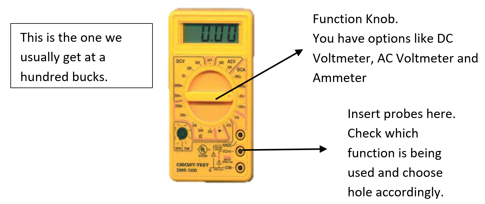

# Getting Started {#getting-started}

## What You Will Need: {#what-you-will-need}

To get through with this you will need some time, dedication and a certain amount of patience.

Along with that you will need 10% luck, 20% skill, 15% concentrated power of will, 5% pleasure, 50% pain and….. (For those who did not get the reference please ignore… sorry)

So on a serious note you will be needing the following things. If you are not sure about all this and want to just get an idea, you can borrow most of the needed stuff, colleges also have these. If you are even slightly serious about making stuff and DIY electronics then I strongly suggest you get yourself this equipment.

*   Digital Multimeter

There is a wide variety available ranging from 100 rupee ones to 5000 rupee industrial standard. For most part the 100 rupee one is sufficient. But if you are considering doing more projects like this I would advise you to invest a bit more and get something a bit better around 300 – 500 rupees.

This is the one we usually get at a hundred bucks.

Function Knob.You have options like DC Voltmeter, AC Voltmeter and Ammeter

https://encrypted-tbn3.gstatic.com/images?q=tbn:ANd9GcSfwcJL1xN1IK5lhE-YiC7klKyGOmBa4kz7LMnwLuc8g2_JbaLD1w

Insert probes here.Check which function is being used and choose hole accordingly.

Always disconnect the probes before changing the mode of the DMM. Suppose you are measuring voltage and suddenly change the mode to Ammeter, your system will get short circuited and damaged!

*   https://encrypted-tbn0.gstatic.com/images?q=tbn:ANd9GcQXI8YMO77S4wbMGubkpE8kTYJ_x30Z9BM-QxY9uCDhg5dcq56oSoldering Gun The soldering gun we most easily get in these areas is the yellow coloured Solderon soldering iron (25 Watt). This is completely sufficient for all DIY projects and is even capable of SMD soldering.Most soldering guns come with a flat ringed metal tip. For SMD work you can use the pointed tip. There is a different type of tip available known as a coated tip. It is about 3 times the cost of a normal tip but gives superior performance and lasts a lot longer. If you are going to do a lot of soldering work give it a try.

*   Solder Metal and Flux Solder metal for obvious purposes. The flux is optional but it makes soldering a whole lot easier.

http://3.imimg.com/data3/YQ/RI/MY-10536612/silder-flux-250x250.jpeghttp://s3.amazonaws.com/emimg/Products/NN-156/1B.JPG

*   Wire Stripper and similar tools. This again is optional depending upon your project.

Other than the above stuff all that you need for the ArduDIY is provided in this kit.
