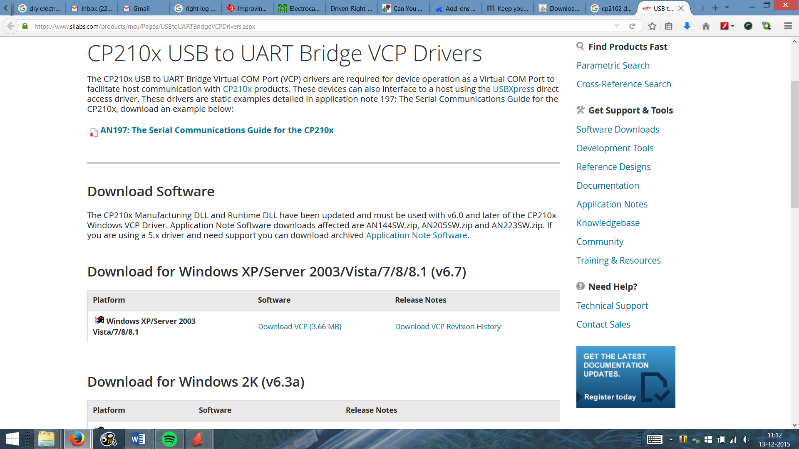
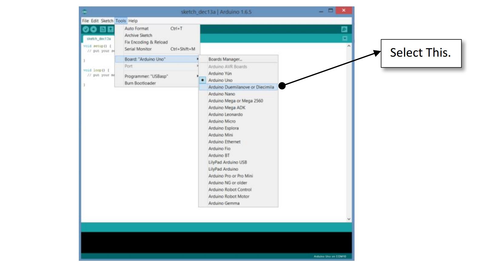
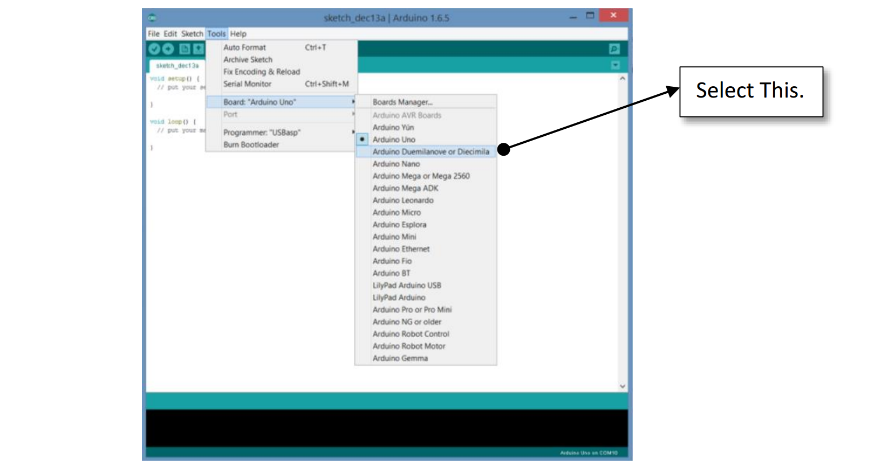
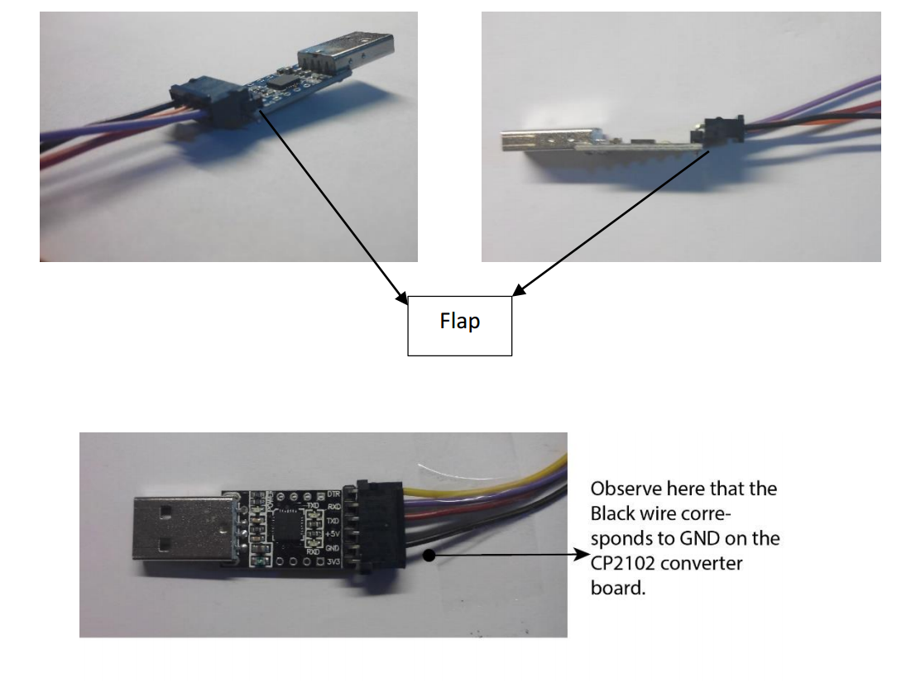
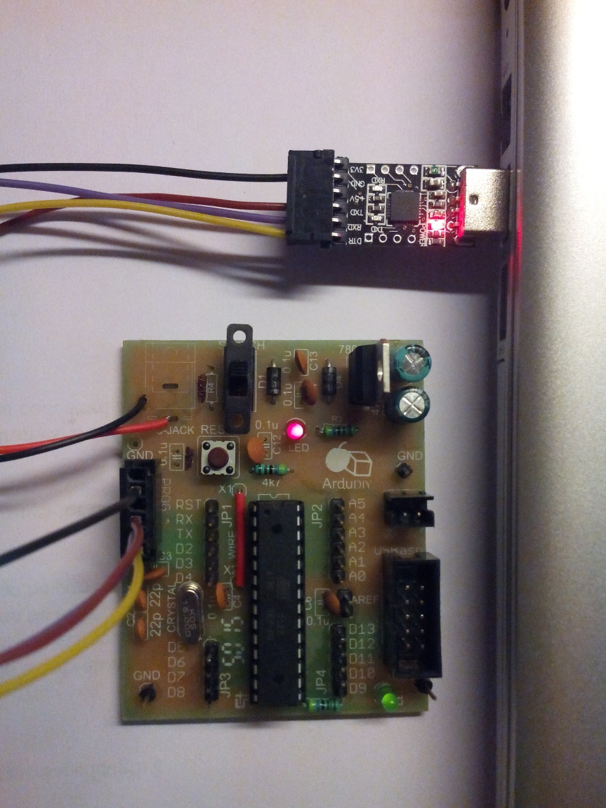

# Software &amp; Programming {#software-programming}

Before we begin you shall need to install two things. Firstly the Arduino IDE and secondly the drivers for our converter board.

You can get the latest Arduino Software at [www.arduino.cc](http://www.arduino.cc) On their homepage select the download tab. At the time of writing this Arduino 1.6.6 was the latest version, though all higher versions will also work. Preferably use the Arduino Installer and not the ZIP file. It makes things easier. Once you have downloaded, install Arduino.

Now we install the drivers for our software board. The converter IC on the board is CP2102\. It is manufactured by Silicon Labs, we can obtain the drivers from their website. Just Google “CP2102 driver” It should probably be the first link. This is the full link. [https://www.silabs.com/products/mcu/Pages/USBtoUARTBridgeVCPDrivers.aspx](https://www.silabs.com/products/mcu/Pages/USBtoUARTBridgeVCPDrivers.aspx)The download page looks like this. Download the Drivers and install them.

Once you have installed the drivers you can plug in the converter board into your USB port.You will get a notification and the PC will auto detect. Now we have to know which COM port has been assigned to our converter board.(Basically how this works is that for any I/O device we connect to our PC, Windows assigns it a COM port number. To use this port we have to know the COM port number. )

To view the COM port on Windows 7 and above. First plug in the Converter Board into the USB. Then right click on “My Computer” and click on “Manage”.Then click on “Device Manager” on the left. After then click on “Ports (COM &amp; LPT)” on the list that appears on the right.You will see the connected converter board along with the COM port name in brackets.If “Silicon Labs CP210x USB to UART Bridge” cannot be seen here the drivers have not installed properly.

So now that we know our COM port number, open the Arduino IDE.Before we can start programming, we will need to set some settings in the Arduino software.

Go to Tools -&gt; Board -&gt; And select Arduino Duemilanove or Diecimila

Now go to Tools -&gt; Processor and select ATmega328

Lastly go to Tools -&gt; Port -&gt; Now select the COM port of our converter board. The Converter board must be plugged in before doing this!

Now Connect the Convert Board to our Arduino Board. We use the given Relimate Wire to do this. On our Arduino Board this wire goes inside only on way. On the Converter Board there are bergstrips, so the Relimate can be inserted both ways. Hence care must be taken. Look at the way we plug in the Relimate.

Basically the flap on the Relimate should be downwards.

Once you have connected the Relimate, the whole arrangement should look like this:

Just a little tip: when you want to remove the Relimate wire from the Arduino board, do not just pull it out. Doing that will reduce the life of your Relimate. The proper method to remove the Relimate is using your finger pull the Relimate in the direction of the flap while pulling it upwards. It should easily come off this way.

## Let’s start Programming!!! {#let-s-start-programming}

You must know about “Hello World” it is the first program we try out whenever learning a new language. “Blink” is the Arduino equivalent of Hello World. What this code does is it starts blinking the connected led of the Arduino Board. Let us burn this Code onto our ArduDIY.

Go to File -&gt; Examples -&gt; Basics -&gt; Blink

This shall open the code in a new Arduino Window.

Now Click on the Verify Icon. What this does is it compiles the code (sketch). If there are any errors in the code it does not compile and we get an error. A sketch can be compiled even when the Arduino Board is not connected.

Now Click on the Upload Icon. This again compiles the code but now after compiling, the code is burned onto the ATmega328 of our board.

You will get a Done Compiling message. If there is some error look at the troubleshooting section.

If everything works correctly the Green LED on our board should start blinking on/off.

Congratulations, you just ran your first code on the Arduino!!!

This is just the beginning and the sky is the limit! Everyday people are doing something new using the Arduino, take inspiration from them, and join them!

Keep in mind you will have to periodically change the Battery. Change it immediately if the board stops working or LEDs start glowing dim. The battery voltage should never drop below 7V.
