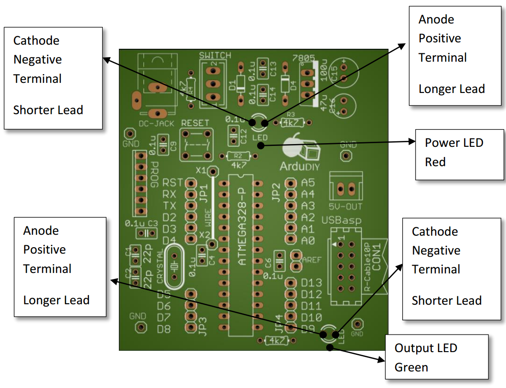
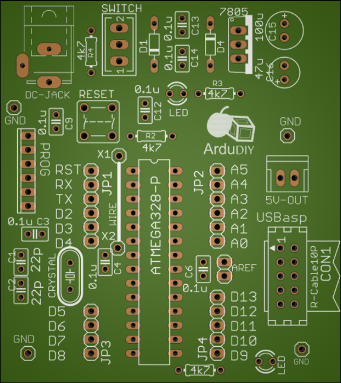
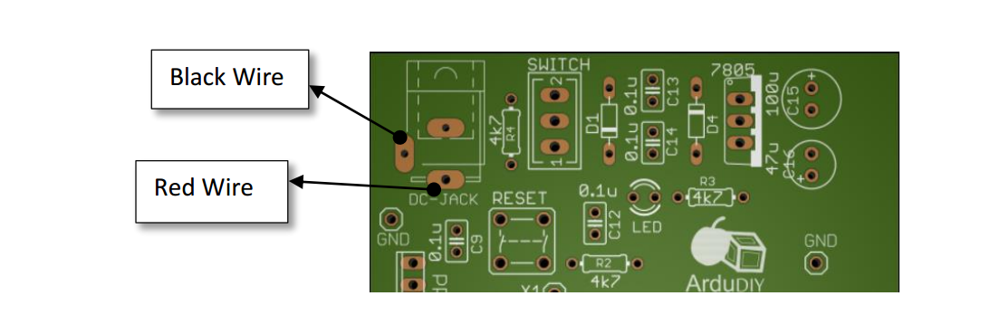

# Soldering {#soldering}

Soldering is one of the most important tools at the disposal of a DIY enthusiast. It helps in rapid prototyping, repairing and building stuff from scratch.

Proper soldering is essential.

**If a joint is not soldered properly the board won’t work as expected and debugging is very hard when there are 40 to 50 solder joints along with components, we can’t find out if a component is faulty or the soldering is. Thus take utmost care while soldering and double check each joint.**

The tools we shall require for soldering have been listed earlier. Here is a list just to recheck.

*   Soldering Gun

*   Solder Metal

*   Wire Cutter

*   Flux (Optional though preferred)

*   Wet Sponge (Optional)

*   Soldering Gun

The soldering gun we most easily get in these areas is the yellow coloured Solderon soldering iron. This is completely sufficient for all DIY projects and is even capable of SMD soldering. If you are soldering more intricate stuff I recommend using a soldering station. The advantage with these is that they come with temperature setting, proper grounding for ESD protection and other such facilities which help in better soldering. Please conduct proper research before buying a soldering station. As far as possible do not buy Chinese replicas, they seem cheap but will give you problems within a month.

Most soldering guns come with a flat ringed metal tip. For SMD work you can use the pointed tip. There is a different type of tip available known as a coated tip. It is about 3 times the cost of a normal tip but gives superior performance and lasts a lot longer. If you are going to do a lot of soldering work give it a try.

Soldering is an art, every individual has his own soldering style. If you are practise soldering you too will come to realise this. You can make out who has soldered a board just by looking at it. I urge you to look at the basic techniques and then develop your own style. There are many options, you could go with whatever is the fastest or whatever seems the safest or anything!

*   Flux

    What flux basically does is it removes the metal oxide layer which is formed due to high heat. This layer is the blackened stuff you see on your soldering gun and on the board. Oxidation eats away at the metal and comes in the way of a proper solder joint. It can give rise to dry solder. There are many types of flux like liquid flux, flux paste etc..

*   Solder Wire

    Solder wire is easily available is most electronics shops. Observe the thickness before buying, if it seems too thick it may give problems melting properly.

*   Wet Sponge

    If you have a soldering gun stand you must have noticed a small yellow thick sponge on the front. This is meant to clean the gun and must be wetted before use. Just rub the tip of your gun over the sponge. Do this with a swiping movement without maintaining contact for too long.

**How to Solder**

*   Check that you soldering gun is properly heated. (You should be able to feel its heat near your face from a distance of 10 cm.)

*   Place the component through the holes. Fasten it if necessary by bending the pins outwards.

*   Touch the soldering iron on the joint you want to solder. Use the flat tip so that it covers the most area.

*   After the joint is sufficiently heated, bring the solder metal into contact of the joint and gun.

*   The metal will melt and flow towards the joint.

*   When enough solder has melted into the joint take the soldering metal away and simultaneously gently lift the soldering gun UP.

*   After the solder has cooled check to see if it has stuck to the joint properly.

*   A perfectly soldered joint is conical in shape.

*   Clean your soldering gun by tapping it in flux and/or using the wet sponge.

**After Soldering**

*   Let the joint cool a bit before moving anything.

*   Visually check the joint to see if the solder has held on to the joint correctly. I have observed that visual inspection is many times the best method of checking.

*   Use a DMM in continuity mode.

  

<!--- -->

Now let’s start with the soldering. We go step by step starting from the small components first. Use this image as a reference. All components are labelled along with polarity where ever required.

Use that Image as a reference for locating where components are. It is an image of the bare PCB board without any components. You will notice that as you go on soldering components it gets harder to spot where you have to solder new components.

Go in this order for soldering the components, it will be easier this way. Tally the components with the quantity given. That way you will not miss out on any components.

| Component Name | Value | Quantity |
| --- | --- | --- |
| Resistor | 4k7 | 3 |
| Ceramic Capacitor | 0.1uF | 6 |
|  | 22pF | 2 |

**DO NOT SOLDER CAPACITOR C9 and RESISTOR R4\.**

**For soldering the Electrolytic Capacitor, first identify which terminal is negative and which positive.**The PCB has a marking for the positive terminal.

| Electrolytic Capacitor | 47uF | 1 |
| --- | --- | --- |

|  | 100uF | 1 |
| --- | --- | --- |

| Diode | 1N4007 | 2 |
| --- | --- | --- |
| LED | 3mm | 2 |

**Similarly for the LEDs and diodes, first identify the anode and cathode.**

AnodePositive Terminal

Longer Lead

**The diodes have a clear marking to show the polarity (the side with the band is cathode or negative terminal).**The Led on the other hand has no such marking. Use this for reference.

AnodePositive Terminal

Longer Lead

AnodePositive Terminal

Longer Lead

CathodeNegative Terminal

Shorter Lead

G:\data1\ArduDIY\Images\ArduDIY_Board.png

Power LEDRed

Power LEDRed

CathodeNegative Terminal

Shorter Lead

CathodeNegative Terminal

Shorter Lead

Output LEDGreen

Output LEDGreen

**Note that both LEDs have a different orientation.**

You can swap the led to a colour of your choice, Blue and white is a great combination.

Now we solder the Reset Switch. Look at the diagram on the board properly and then connect accordingly. Remember there are two sets of switches in our reset switch. Solder it like this. **Later keep in mind to check this with the DMM as, if this is not soldered in proper orientation, the board will continuously be in reset state and won’t work.**

G:\data1\ArduDIY\Images\splabcomponents\DSC_1255-1.jpgG:\data1\ArduDIY\Images\ArduDIY_Board.png

| IC Base | 28 Pin | 1 |
| --- | --- | --- |

G:\data1\ArduDIY\Images\splabcomponents\IMG_20151212_204042.jpg

For the IC base, place it on the board and support it from the other side with your fingers (careful so that you do not burn yourself). Now solder two pins diagonally. After that you can solder the rest of the IC base with ease.

| Bergstrip | - |  |
| --- | --- | --- |

Now let’s solder the Bergstrip. Cut it out in pieces with a cutter. There is a technique to solder this easily. Initially solder just the first pin and adjust the Bergstrip by touching the other side, so you do not burn yourself. Once a pin is soldered you can continue with the complete strip. After doing that just retouch the first pin you soldered again. The single pin (1x1) Bergstrip soldering can be a bit tricky. Use someone’s help to hold the other side using forceps or a plier or if you are doing it yourself use the plastic housing to adjust the pin without touching it for too long.

Use the image of the completely soldered board to get where bergstrips must be soldered.

| 7805 | - | 1 |
| --- | --- | --- |
| Slider Switch | - | 1 |

Ok almost there, we now solder the slider switch and the voltage regulator. For the regulator look at the indication on the board for proper orientation.

| Battery Connector | - | 1 |
| --- | --- | --- |

The battery connector wires need to be soldered onto the board. There is also a provision for soldering a DC Jack on the board, you can proceed with what you are comfortable with. Just put the wire through the slot and solder it on the bottom. Look at the image below to get the positions for the red and black wires. You can also solder a DC jack here in case you are using an adapter.As you can see the original component on the board is a DC Jack.

Red Wire

Black Wire

G:\data1\ArduDIY\Images\ArduDIY_Board.png

| Single Strand Wire | - | 1 |
| --- | --- | --- |

While soldering the wire, first cut the wire to proper length. An easy way to do this is to directly take a measurement by placing the wire on the board. Now strip the ends of the wire to expose the strand underneath. Once that is done place the wire in the two holes provided. Solder one end first, check, then solder the other point. As far as possible try to keep the wire as close/ flat to the PCB as possible. This is not only a good soldering practise but will also make the board neater and prevent the wire form coming in between other components.

G:\data1\ArduDIY\Images\attachments_new\DSC_1560.JPGG:\data1\ArduDIY\Images\ArduDIY_Board.png

| PCB Mount Relimate | 6 pin | 1 |
| --- | --- | --- |
|  | 2 pin | 1 |

When soldering the Relimate we must take care that it is soldered in the proper orientation. First identify the flap. When soldering the flap must be outwards. Use the print on the PCB as reference.

This is the flap.It is facing the outer edge of the board.

G:\data1\ArduDIY\Images\ArduDIY_Board.pngG:\data1\ArduDIY\Images\attachments_new\DSC_1560.JPG

| Box Header | 10 Pin | 1 |
| --- | --- | --- |

G:\data1\ArduDIY\Images\attachments_new\DSC_1560.JPGAlmost there, while soldering the box header first identify pin number 1 on both the header an on the PCB. To identify pin number 1 read the section above where all components are introduced (It is shown by a small arrow on the header as well as the board).

Pin number 1.

G:\data1\ArduDIY\Images\ArduDIY_Board.png

| Crystal | 16MHz | 1 |
| --- | --- | --- |

The crystal is the last component we solder. This is because the quartz crystal is quite sensitive. Do not hold you soldering gun to its points for too long while soldering. But do place it properly (pressing it onto the surface so that that there is no space between the crystal and the PCB) and solder it thoroughly.

Now that we are done soldering, take a break and look upon what you have made 

Here are some reference images.The DC jack is not included in this kit, you can solder it if you plan on powering this board using an adapter. The adapter can be 8V to 20V.Preferablly 12V.

G:\data1\ArduDIY\Images\attachments_new\DSC_1560.JPG

G:\data1\ArduDIY\Images\attachments_3\DSC_1603.JPG

G:\data1\ArduDIY\Images\attachments_3\DSC_1602.JPG
