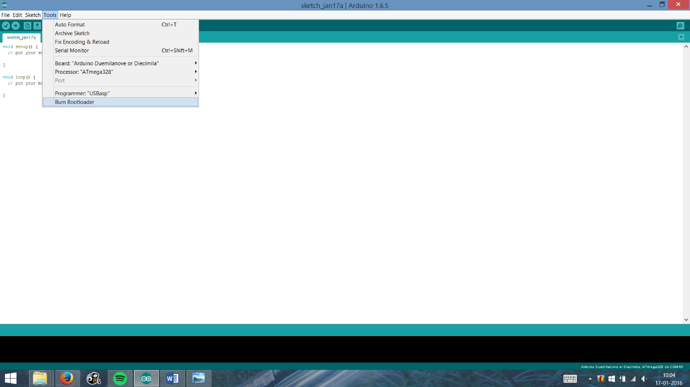

# Step 5: {#step-5}

To run Arduino you shall need an IC with the Arduino bootloader burnt. Now you can directly buy a IC with the Arduino bootloader pre-programmed or you can burn it yourself.

If you want to avoid the trouble of bootloading the IC yourself, just buy a bootloaded IC from me.

To do this you shall need a dedicated programmer such as the USBasp. The ArduDIY board provides a port to which the USBasp can be directly connected thus removing the need for jumpers.

To use the USBasp you will have to install its drivers. They are available on [www.fischl.de/](http://www.fischl.de/usbasp/)[**usbasp**](http://www.fischl.de/usbasp/)[/](http://www.fischl.de/usbasp/)

Installing drivers for Windows8 and above is slightly complicated. The complete procedure is given on [http://letsmakerobots.com/node/36841](http://letsmakerobots.com/node/36841). This link is also available on the USBasp driver page at the fischl website. It has been tried and works.

Once you install your drivers, just connect your USBasp to the Arduino and your PC, then use option burn bootloader.

Before burning the bootloader select the board on which you are going to use the ATmega. You can also make ATmega328’s meant for the Arduino Uno by selecting Arduino Uno under Boards before burning bootloader. For IC’s meant for the ArduDIY, just select the same options you use for programming i.e. Arduino Duemilanove and processor ATmega328

The programmer leds will flash and in some time you will get the done burning message. Now your ATmega is an Arduino. You can now remove the IC from your ArduDIY board and use it on any other custom board you have designed.