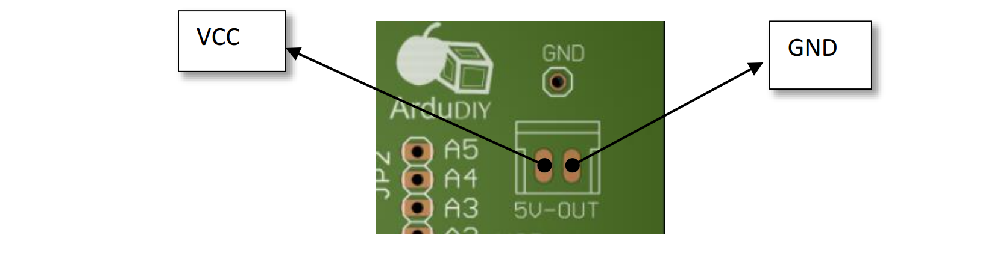
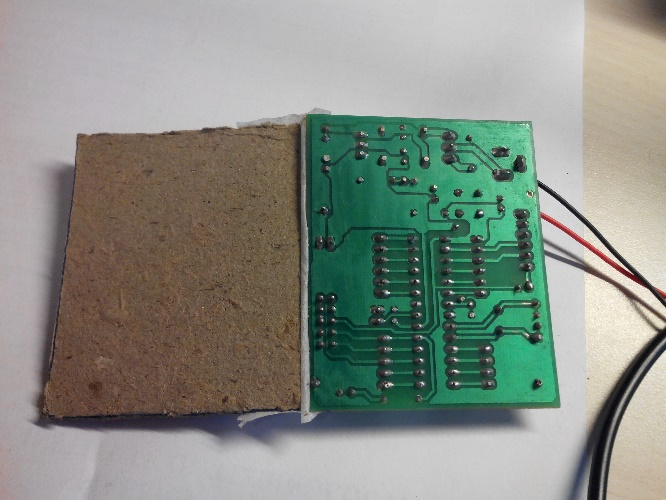
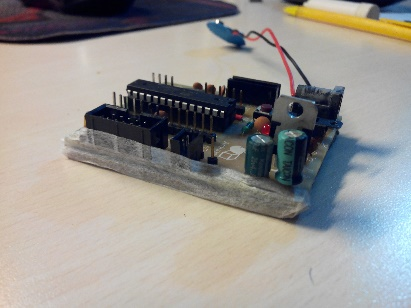

# Testing {#testing}

Now that we are done soldering, before we actually start we need to perform some basic testing on the board. **Before we plug in the battery and the ATmega328**. This is done to prevent damage to components in case of any error. This is known as dry testing. A dry test means completely checking the board for soldering flaws, incorrect component flaws and connection errors without connecting the power supply.

This must always be done before using any soldered board.

Suppose due to some error the Vcc and Ground of a soldered board is short circuited (connected directly) now if we connect the supply without dry testing a large amount of current will flow through the board and it could damage components and even destroy the board due to excessive heating. Now that’s a lot of pain due to a simple problem. That’s why always Dry Test!

## Visual Checking: {#visual-checking}

Turn the board around and have a good look at all the soldering points. Start from the top left corner and progress towards the right line by line till you reach the bottom right corner.

Keep a look out for any stray solder splashes or dots, see that every joint is soldered properly and has a conical shape. There should not be any irregular soldering and this leads to something known as dry solder and the whole component may come off after a few uses.

## Testing Using the DMM: {#testing-using-the-dmm}

Put the DMM in continuity mode (the mode where the DMM beeps when the two probes are connected to each other). Now the first most important thing we check is the VCC and GND. We do not want the board to go poof the moment we turn it on. The best place to check this would be the 5V Output Port. **Remember to hold the DMM there for a long while if it is showing a short. This happens due to the electrolytic capacitor we have connected. If the DMM beep does not stop even after 40 seconds, then we have a problem.**

**These two must not be connected in any circumstance.**

## Turn the board on: {#turn-the-board-on}

**DO NOT PLUG THE Atmega 328 IN AT THIS POINT**

Connect the battery to its connector and turn the slider switch on. The power led should turn on. Everything else should be off. Carefully touch the voltage regulator gently. It should not be burning hot. If it is very hot immediately switch off the board and plug out the battery, there is a short circuit.

After you have turned it on and the regulator is not hot, wait for about 20 seconds. Again check that the regulator is not very hot (warm is ok). The red LED should be continuously on. If everything is alright we can proceed.

## Plugging in the Atmega328: {#plugging-in-the-atmega328}

Now that we have tested most of the components, we plug in our controller. Gently plug the IC into the base. The U notch on the top of the IC should match the U on the IC base (there is a small one, observe carefully). Be very gentle about this and take care that all pins are inside the base.

If you ever want to remove the IC from its base, do so with the help of a small flat screw driver. Gently lift one edge then the other edge, keep on doing this till the IC comes out. It must be done in this way to prevent bending of the IC pins.

**The ATmega328 provided is preloaded with the Arduino bootloader.** Only ICs with the Arduino Bootloader can be used as an Arduino. That is why ICs bought from the market won’t directly work unless you burn the bootloader.

Now that our hardware side is ready, it’s time to move on to the software.

**ALWAYS COVER THE BOTTOM OF YOUR PCB WHEN USING.**

While using the ArduDIY for your projects, always keep the bottom side (this is the side you soldered on) covered. Many times we absent-mindedly keep the board on your work table as it is. Our work table is littered with wires and small pieces of metal, especially the small strands we get after cutting the legs of a resistor or capacitor. These can touch and connect two points on our board and short circuit the whole system damaging the board.

Sometimes we also need to check the bottom soldered part of the board, so it’s not a good idea to permanently close off the bottom. The best solution is to use a thick cardboard and tape it on one side of your board. This way when using it the cardboard will cover the board and if needed the cardboard can be just folded off to access the board.

Take any cardboard of good thickness (covers of our old hardbound notebooks works well) mark the boundaries of the PCB, and cut away. Stick only one side with scotch tape.

