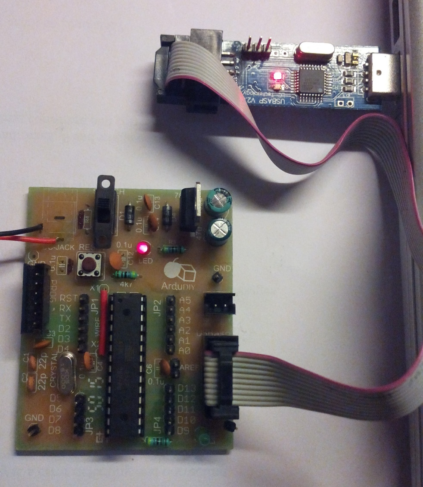

# The Arduino Bootloader {#the-arduino-bootloader}

The bootloader is basically a .hex file that runs when you turn on the board. It is very similar to the BIOS that runs on your PC. It does two things. First, it looks around to see if the computer is trying to program it. If it is, it grabs the program from the computer and uploads it into the ICs memory (in a specific location so as not to overwrite the bootloader). That is why when you try to upload code, the Arduino IDE resets the chip. This basically turns the IC off and back on again so the bootloader can start running again. If the computer isn’t trying to upload code, it tells the chip to run the code that’s already stored in memory. Once it locates and runs your program, the Arduino continuously loops through the program and does so as long as the board has power.

If you are building your own Arduino, or need to replace the IC, you will need to install the bootloader. You may also have a bad bootloader and need to reinstall the bootloader. There are also cases where you’ve put your board in a weird setting and reinstalling the bootloader and getting it back to factory settings is the easiest way to fix it. We’ve seen boards where people have turned off the serial port meaning that there is no way to upload code to the board, while there may be other ways to fix this, reinstalling the bootloader is probably the quickest and easiest.

We use a dedicated external programmer the USBasp for burning the bootloader. A port for direct connection with the USBasp has been provided on the ArduDIY. You can also use this to upload code to the Arduino using the “Upload Using Programmer” option.

You will need to buy an USBasp separately. Don’t worry its widely available.

  

